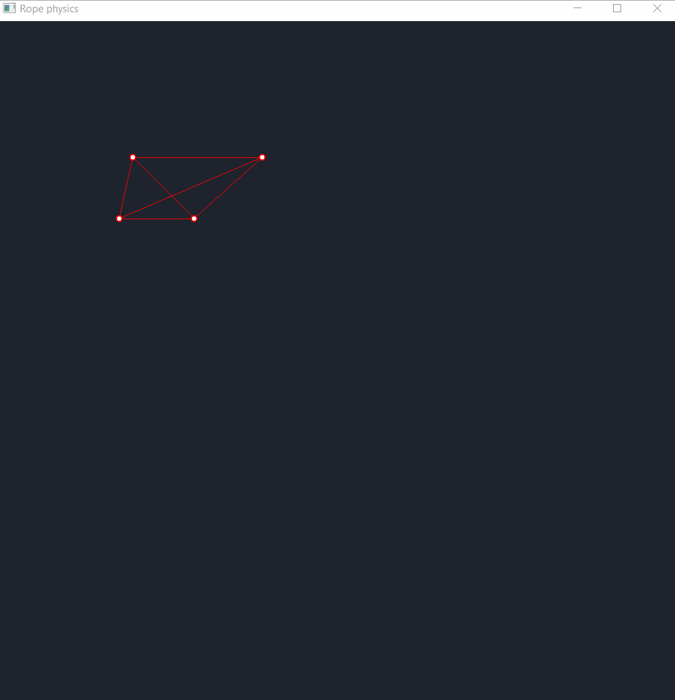

# RopePhysics

! WORK IN PROGRESS !
Eventually, this should have a rope with physics in 2D with a UI that allows you to edit the properties of the rope
and interact with it.

## Demos:

Demo 1: 
 
This shows 2 nodes connected by a line between them (the line does not apply any force to the nodes
yet, this will change) and the nodes being affected by forces like gravity, bounce and friction.

Demo 2: 
 
In this build, I was able to make a system that supports any kind of polygon comprising of nodes and sticks acting as forces on the nodes.
These polygons have physics applied to them as well don't interact with eachother, but interact with their boundary (the window) in a convincing way.

### Todo:

 - Add properties to the nodes and sticks to allow some nodes to be unaffected by any forces
 - Create a rope with adjustable properties
 - Get mouse input to interact with program
 - UI (Imgui)
