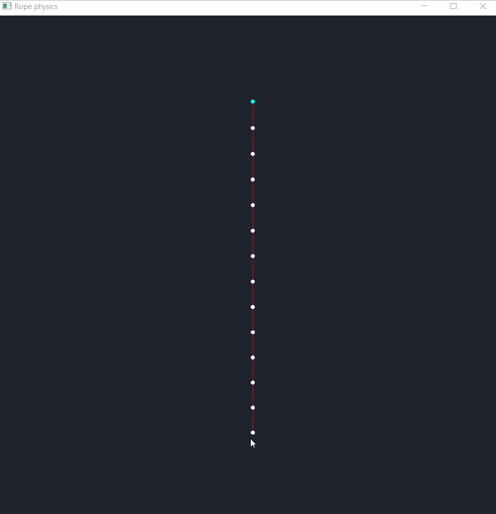
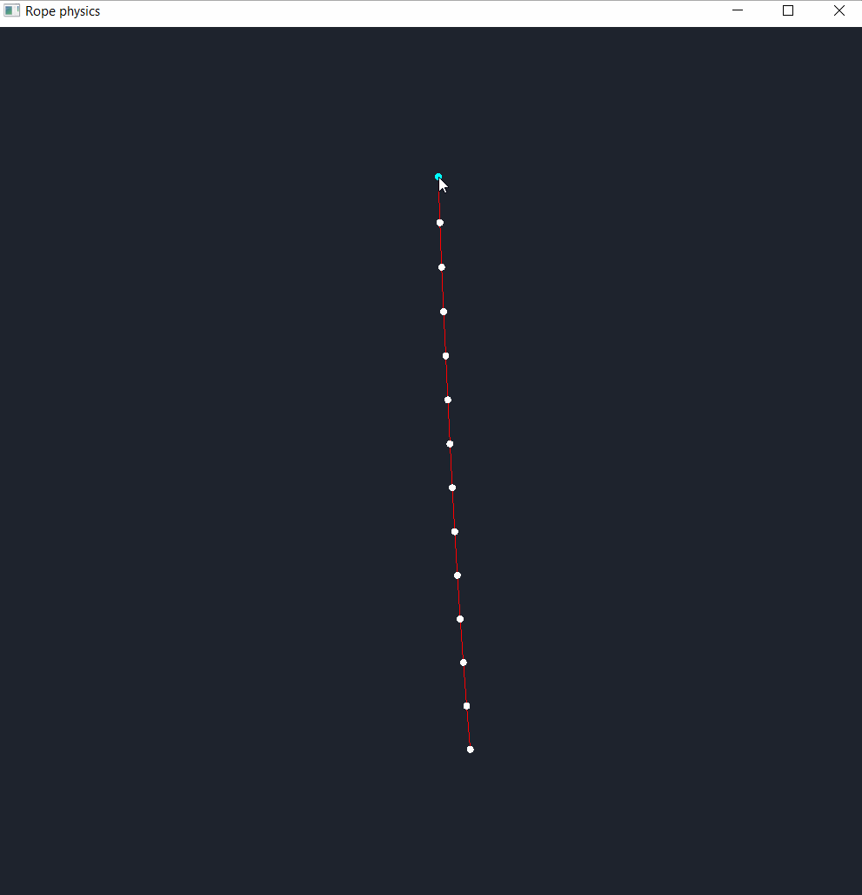
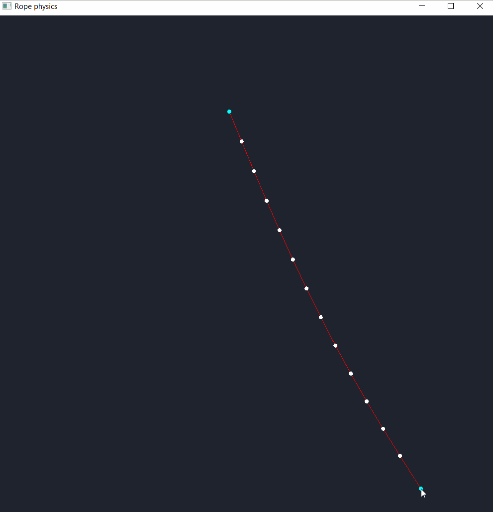

# RopePhysics

 

RopePhysics is an application of Verlet integration, a system to displace nodes in space by calculating a velocity given two positions,
as opposed to Euler integration which calculates a position given velocity. It was created to explore these concepts which will become
necessary in an upcoming game development project I'd like to work on.
RopePhysics was made using C++ and SFML for rendering.

## Controls:
 - Left click + drag : Move a node around
 - Right click : Toggle whether a node becomes frozen in space

## Demos:

### Final demo: 
I think by this point, I've hit all the functionality I wanted to look for in this project, a detailed list is at the top of the readme.
Now there's a believable rope that you can interact with and do some pretty cool stuff with. This was a neat overview for Verlet integration
and I definitely see myself using it down the line (It'll have immidiate applications in a game I'm about to start working on.) 
Here's a showcase of some of the things it's capable of: 
 
 

### Demo 2: 
 
In this build, I was able to make a system that supports any kind of polygon comprising of nodes and sticks acting as forces on the nodes.
These polygons have physics applied to them as well don't interact with eachother, but interact with their boundary (the window) in a convincing way.

### Demo 1: 
 
This shows 2 nodes connected by a line between them (the line does not apply any force to the nodes
yet, this will change) and the nodes being affected by forces like gravity, bounce and friction.

### Todo:

 - Create a build with a .exe
