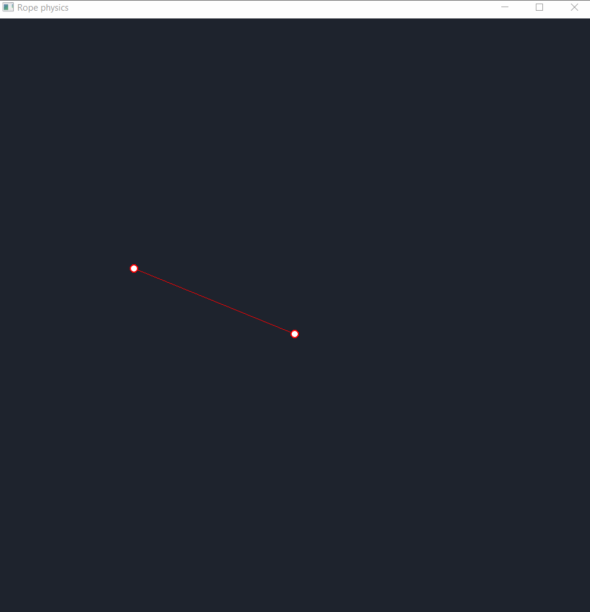

# RopePhysics

! WORK IN PROGRESS !
Eventually, this should have a rope with physics in 2D with a UI that allows you to edit the properties of the rope
and interact with it.

## Demos:

Demo 1: 
 
This shows 2 nodes connected by a line between them (the line does not apply any force to the nodes
yet, this will change) and the nodes being affected by forces like gravity, bounce and friction.

### Todo:

 - Create sticks between nodes with active forces
 - Get mouse input to interact with program
 - Create chain of nodes with sticks inbetween
